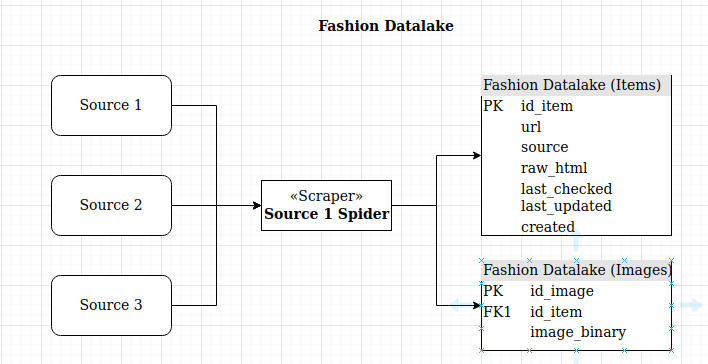
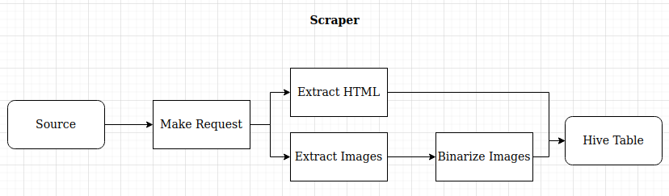
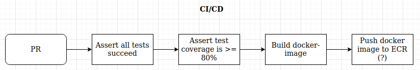

# Fashion DataLake

Create and maintain a continuously updating hive datalake.

## Project Overview

The project is split into three sections:

1. Datalake Setup
2. Scraper Workflow
3. CI/CD

## 1. Datalake

### 1.1 Overview

The datalake workflow consists of the **Spider**, which continuously requests data from one or more sources and stores the results in one of two Hive **tables**.

### 1.2 Sourcing Spider

The sourcing spider uses the same interface for all requested sources, to retrieve full HTMLs of the found fashion items (e.g. shoes, pants, etc...). For details on the scraper's workflow, see section 2.

### 1.3 Items Table

The items table stores full, unparsed HTML received for the items on the sourced website.

The id_item is primary key of this table. The id_item is derived from the hash values of the **URL** or the item. The **source** refers to the source for which the associated item was sourced. The **source** column also serves as the partitioning column for this table.
The **raw_html** column contains the raw, unparsed html text for the associated item. The **last_checked**, **last_updated** and **created** column refer to when the associated item was last requested, when it was last changed and when it was initially created, respectively.

### 1.4 Images Table

The images table contains all images that were found in the source. The **id_image** serves as the primary key of this table. It is derived from the hashed value of the image binary.

## 2. Scraper Workflow

### 2.1 Overview

### 2.2 Requests

The spider will find and make the items in the specified source and request the HTML contents through a splash server.

### 2.3 Extract HTML / Extract Images

From the response, the raw, unparsed HTMLs and images will be extracted. The associated values (id_item, etc...) will be calculated at this step.

### 2.4 Binarize Image

Extracted images will be binarized, so that the resulting binary can be saved in Hive. The id_image will be calculated at this step.

### 2.5 Send to Hive

As images are uniquely identified by their hashed binary, they will always either be uploaded, or not, if the id_image already exists.
If the **id_item** does not exist in the hive table, the entry is created. **last_checked**, **last_updated** and **created**. Will take the same value. If the **id_item** already exists, but the HTML is identical to the existing entry, only the **last_checked** value is updated, otherwise the last_checked and the last_updated values are updated, together with the raw_html

## 3. CI/CD

### 3.1 Overview

### 3.2 Workflow

By using GitHub Actions, the following steps will be executed for every PR to main and to develop.

- Assert all tests succeed -> All unit and integration tests need to succeed for the PR to be approved
- Assert test coverage is >= 80% -> Ensure, that submitted code is sufficiently tested
- Build docker image -> Ensure that docker image(s) can be built
- Push docker to repository -> The built docker file will be pushed to a remote repository (docker or ECR) to make the service available for other repositories

## 4. Supported Sources

TBD

## 5. Getting Started

TBD
